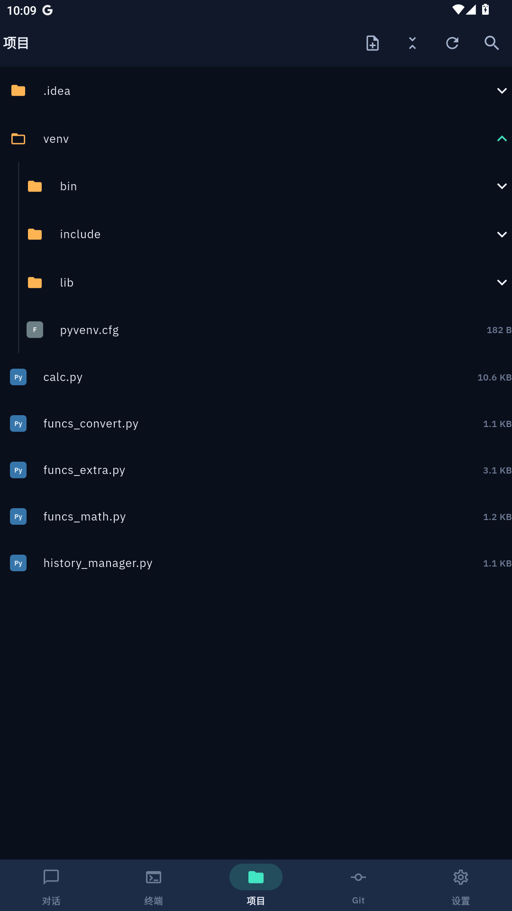

<p align="center">
  
</p>

<h1 align="center">Pocket Coder</h1>

<p align="center">
  <strong>AI coding assistant in your pocket — control your desktop AI agents from your phone.</strong>
</p>

<p align="center">
  <a href="../../releases">Download</a> •
  <a href="#features">Features</a> •
  <a href="#quick-start">Quick Start</a> •
  <a href="README.zh-CN.md">中文文档</a>
</p>

---

## What is Pocket Coder?

Pocket Coder connects your phone to AI coding tools running on your desktop. Chat with AI, browse files, edit code, run terminal commands, and manage Git — all from your phone.

Your code stays on your computer. Pocket Coder is just the remote control.

## Features

| | Feature | Description |
|---|---|---|
| 🤖 | **AI Chat** | Talk to Claude Code, Codex, Gemini CLI, Copilot, Aider and more |
| 📁 | **File Browser** | Browse, view (100+ languages highlighted), and edit files |
| 🔀 | **Git** | Diff, stage, commit, push, pull, branch switch, log |
| 💻 | **Terminal** | Full terminal emulator on your phone |
| 🔒 | **Encrypted** | End-to-end AES-256 encryption, zero third-party servers |
| 📡 | **Flexible** | LAN direct, remote relay, or self-hosted tunnel |


## Screenshots

<p align="center">
  
  
  
</p>

## Quick Start

### 1. Install Agent (Desktop)

Download from [Releases](../../releases):

| Platform | File |
|----------|------|
| Windows | `mobileflow-agent-windows.exe` |
| macOS | `mobileflow-agent-macos` |
| Linux | `mobileflow-agent-linux` |

### 2. Install App (Phone)

| Platform | Download |
|----------|----------|
| Android | [APK from Releases](../../releases) |
| iOS | Coming soon |

### 3. Install an AI Tool

You need at least one AI CLI tool on your desktop:

```bash
# Pick one (or more):
npm i -g @anthropic-ai/claude-code    # Claude Code
npm i -g @openai/codex                # Codex
npm i -g @google/gemini-cli           # Gemini CLI (free tier)
```

### 4. Connect

1. Launch Agent on desktop → note the IP and password from system tray
2. Open App on phone → enter IP, port (9600), and password
3. Done. Start coding.


## Architecture

```
┌─────────────┐     WebSocket      ┌─────────────┐
│  Phone App  │◄──────────────────►│   Desktop   │
│  (Flutter)  │   E2E Encrypted    │   Agent     │
│             │                    │  (Python)   │
│ • AI Chat   │                    │ • AI CLI    │
│ • Files     │                    │ • Files     │
│ • Terminal  │                    │ • Terminal  │
│ • Git       │                    │ • Git       │
└─────────────┘                    └─────────────┘
```

- **App** — Flutter mobile UI, zero data storage
- **Agent** — Python daemon managing AI tools, files, terminal, Git
- **Protocol** — WebSocket with AES-256 encryption

## Connection Modes

| Mode | Use Case | Latency |
|------|----------|---------|
| **LAN Direct** | Same WiFi network | < 10ms |
| **Remote Relay** | Different networks | ~50-100ms |
| **Tunnel** | Self-hosted server | Depends on server |

> 📖 Detailed setup guide: [Remote Connection Guide](docs/remote-connection-guide.md)

## Security

- All code stays on your computer
- AES-256 message-level encryption (LAN) / NaCl SecretBox E2E (relay)
- Brute-force protection: 3 failed attempts → 60s lockout
- Session tokens — password not transmitted after initial auth
